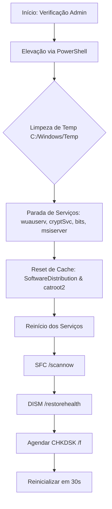

<div align="center">


**WINFIXER — Made with ❤️ by @YGG_.dr**

---

> *Script Python que automatiza tarefas avançadas de otimização e reparo do Windows, com interface CLI estilizada e execução administrativa.*

</div>

---

## 📜 **Visão Geral**
O **Winfixer** executa uma sequência automatizada de limpeza, reparo e otimização do sistema Windows.

### ⚙️ **Funcionalidades**
1. **Limpeza de Arquivos Temporários**  
2. **Reinicialização de Serviços do Windows Update**  
3. **Reset de Cache de Atualizações**  
4. **Verificação de Integridade (SFC)**  
5. **Reparo de Imagem do Sistema (DISM)**  
6. **Agendamento de CHKDSK**  
7. **Reinicialização Automática (opcional)**  

---

## 🖥️ **Como Funciona (Fluxo)**



---

## 🚀 **Instalação & Uso**

### **Pré-requisitos**
- Windows 10/11 (com permissões de administrador)
- Python 3.8+ instalado
- Executar como **Administrador**

### **Passos:**
1. **Baixe o script:**
   ```bash
   git clone https://github.com/seu-usuario/winfixer.git
   cd winfixer
   ```

2. **Instale dependências (se necessário):**
   ```bash
   pip install -r requirements.txt
   ```

3. **Execute com elevação:**
   ```bash
   python winfixer.py
   ```
   > O script detectará automaticamente privilégios e se elevará se necessário.

---

## ⚠️ **Avisos Importantes**

- **Execute por sua conta e risco** – Sempre faça backup antes de executar scripts de sistema.
- **Reinicialização automática** – O script agenda reinício em 30s (cancelável com qualquer tecla).
- **Logs detalhados** – Todas as operações são registradas em `logs/winfixer.log`.

---

## 🛡️ **Segurança**
- Código aberto para auditoria
- Nenhuma conexão externa/telemetria
- Requer confirmação do usuário para ações críticas

---

## 📄 **Licença**
MIT License © 2023 – Made by **@YGG_.dr**

---

## 🤝 **Contribuições**
Issues e Pull Requests são bem-vindos!  
Mantenha o `hacker style` e adicione melhorias com tratamento de erros.
